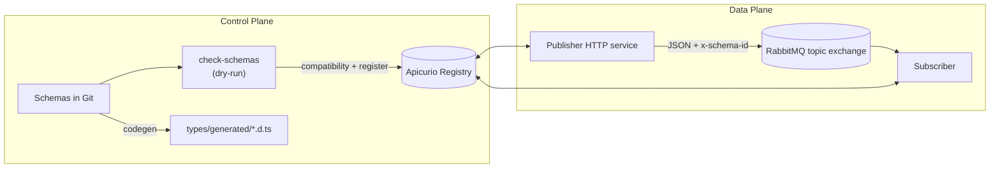
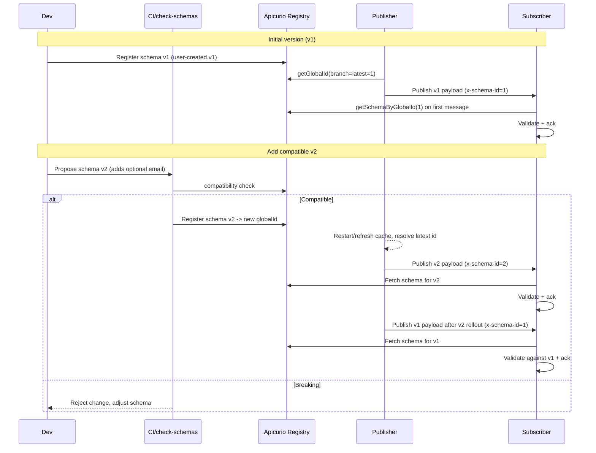

# Apicurio + RabbitMQ POC

POC for Apicurio Integration with RabbitMQ, demonstrating schema registry, validation compatibility.

## Tech requirements
- Bun v1.3+
- RabbitMQ
- Apicurio Registry

## Running Apicurio on Local

```
docker run -it -p 8080:8080 apicurio/apicurio-registry:3.1.2
```

```
docker run -it -p 8888:8080 apicurio/apicurio-registry-ui:3.1.2
```


## End to End Demo
End to End script that registers v1, starts subscriber, publish v1, register v2, publish v2, publish v1 to prove compabitibility
```bash
bun run demo:e2e
```

## Run locally
1) `bun install`  
2) Register v1 schema.  
3) Start subscriber: `bun run dev:subscriber`  
4) Start publisher HTTP server: `bun run dev:publisher`  
5) Publish sample payloads: `curl -X POST http://localhost:3000/publish/v1`

## Register schema
- Compatibility Check: `bun run register:schema --file=schemas/user-created.v1.json --artifactId=user-created --dry-run`
- Register v1 schema: `bun run register:schema --file=schemas/user-created.v1.json --artifactId=user-created`
- Register v2 schema (adds optional `email`): `bun run register:schema --file=schemas/user-created.v2.json --artifactId=user-created`

## Check Schema Compatibility
- Create new version or update current schema on `schemas/`
- Commit the changes
- run `bun run ci:check-schemas`

## Generate types
Pull schemas from Apicurio and generate `types/generated/*.d.ts`:
```bash
bun run codegen
```

## Architecture


## Schema Update & Compatibility Flow


